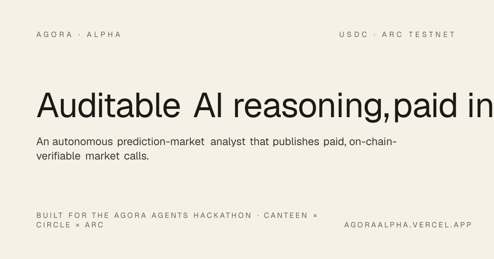
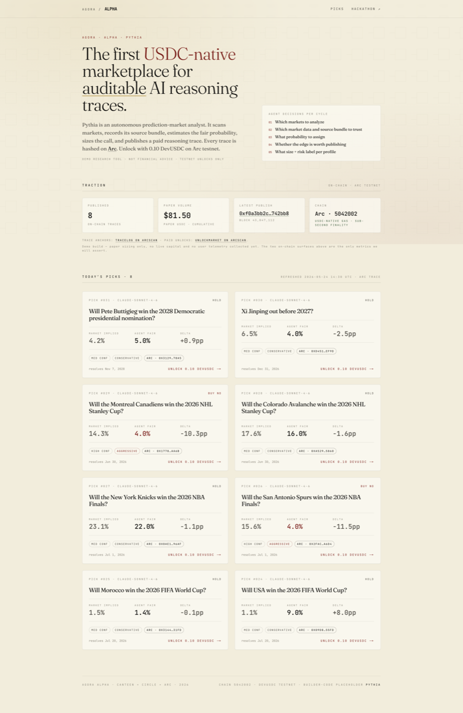
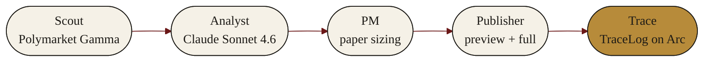
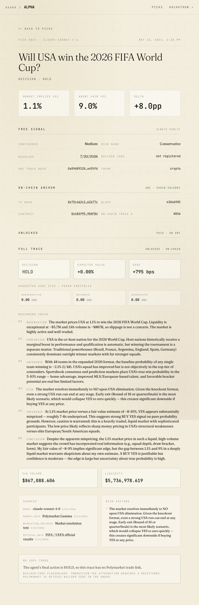
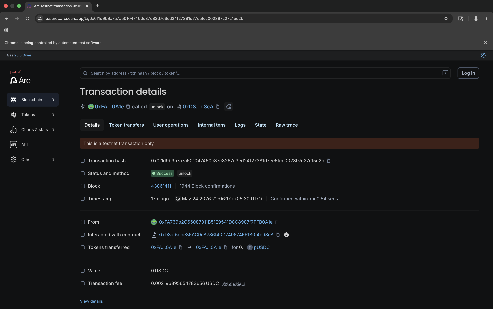
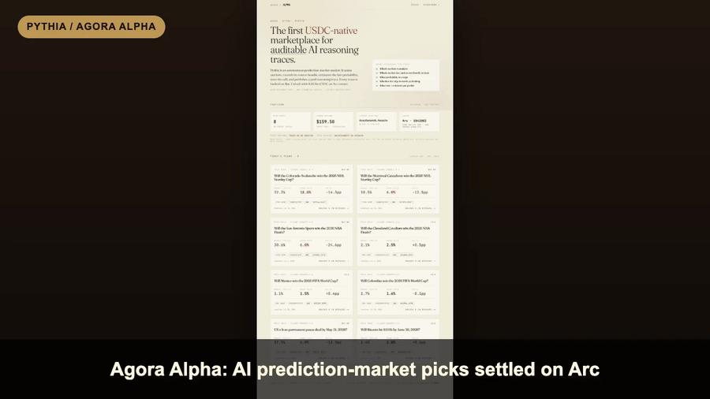

<div align="center">

<!-- <a href="https://agoraalpha.vercel.app"></a>

<br />
<br /> -->

# ✦ &nbsp; P Y T H I A &nbsp; ✦

### *The first USDC-native marketplace for auditable AI reasoning traces.*

An autonomous Delphic oracle for prediction markets. Pythia scans Polymarket, scores each candidate with Claude Sonnet 4.6, sizes a paper position, and publishes a paid reasoning trace — every hash anchored on Arc.

<br />

[](https://agoraalpha.vercel.app)
[](https://testnet.arcscan.app/address/0x48Af95Ed6F1E4dF73Dd62CE17731084a5E98AFB4)
[](VERIFY.md)
[](#-license)

<br />

[**Live demo**](https://agoraalpha.vercel.app) · [**Try an unlock**](https://agoraalpha.vercel.app/pick/24) · [**Verify**](VERIFY.md) · [**Status**](STATUS.md) · [**Hackathon**](https://agora.thecanteenapp.com/)

</div>

---

> *"Every claim about an agent's decision should be byte-verifiable. A track-record in a Google Sheet is not. One on Arc is."*

<br />

<div align="center">

<a href="https://agoraalpha.vercel.app"></a>

<sub><em>↑ The live feed — 8 picks scored by <code>claude-sonnet-4-6</code>, each hashed on Arc testnet.</em></sub>

</div>

<br />

---

## ✦ &nbsp; The Loop

Pythia runs an autonomous **five-stage loop**. The agent never trades its own funds and never custodies user funds. Every recommendation is a free public preview; every full reasoning trace is paid + provable.



| Stage | What happens |
|---|---|
| **Scout** | Ingests live Polymarket candidates from the public Gamma API. Mock fixtures are dev-only. |
| **Analyst** | Claude Sonnet 4.6 scores each candidate for +EV. Deterministic heuristic-v1 is the local fallback. |
| **PM** | Sizes a *hypothetical* position against a virtual `paper_capital` balance. Caps at 10 bps of available depth. |
| **Publisher** | Emits two layers: a free **preview** (thesis + edge) and a paid **full** payload (sizing, alternatives, risks). |
| **Trace** | Writes the canonical hash to Arc via `TraceLog`. The full payload sits behind a nonce-bound, on-chain-gated paywall. |

<br />

---

## ✦ &nbsp; Three Things That Are New

<table>
<tr>
<td width="33%" valign="top">

### ◈ Two-tier traces

Free **preview** for discovery — anyone can read thesis, edge, and the on-chain anchor. Paid **full** payload (sizing, reasoning chain, alternatives) gated by `UnlockMarket.isUnlocked`. The split is at the data-model level, not bolted on.

</td>
<td width="33%" valign="top">

### ◈ On-chain provenance

Every trace hash is written to Arc via `TraceLog`. Sub-second finality, ~$0.01 fees, USDC-as-gas. Reasoning becomes byte-replayable, not screenshot-replayable.

</td>
<td width="33%" valign="top">

### ◈ Non-custodial by design

Pythia recommends; it never trades. Followers place orders themselves on Polymarket via a builder-code deep link. The operator never touches user capital — by construction, not by policy.

</td>
</tr>
</table>

<br />

---

## ✦ &nbsp; See It Live

<div align="center">

<table>
<tr>

<th>Paid unlock</th>
</tr>
<tr>
<td><a href="https://agoraalpha.vercel.app/pick/24"></a></td>
</tr>
<tr>
<td align="center"><sub><em>Post-unlock: sizing, EV, sources, risks</em></sub></td>
</tr>
</table>

<br />

<a href="https://testnet.arcscan.app/tx/0x0f1d9b9a7a7a501047460c37c8267e3ed24f27381d77e5fcc002397c27c15e2b"></a>

<sub><em>↑ Arcscan testnet · <code>UnlockMarket.unlock(24)</code> — 0.1 DevUSDC paid to treasury, trace unlocked on-chain.</em></sub>

</div>

<br />

<details>
<summary><strong>▸ &nbsp; Watch the 60-second demo</strong></summary>

<br />

<div align="center">



<sub><em>Connect wallet → mint DevUSDC → approve → unlock → full payload. <a href="verify/agora-alpha-demo.mp4">MP4 source</a> (564 KB).</em></sub>

</div>

</details>

<br />

---

## ✦ &nbsp; Quickstart

```bash
# 1 · Contracts (Foundry · 42 tests)
cd contracts && forge build && forge test

# 2 · Agent (Python · uv-managed)
cd ../agent && uv sync
uv run pythia-loop --once --mock                # local dev with fixtures
uv run pythia-loop --once --live                # live Claude analyst

# 3 · Web (Next.js 16 · App Router · Tailwind v4)
cd ../web && pnpm install --frozen-lockfile
pnpm dev                                         # http://localhost:3000
```

<details>
<summary><strong>▸ &nbsp; Full deploy + publish flow</strong></summary>

```bash
# Authenticate Arc CLI and fetch RPC URL
arc-canteen login
export ARC_RPC_URL="$(arc-canteen rpc-url)"
export PRIVATE_KEY=0x...

# Deploy all four contracts
cd contracts
forge script script/Deploy.s.sol --rpc-url "$ARC_RPC_URL" --broadcast

# Publish a fresh 8-trace public feed from a non-blocked network
cd ../agent
uv run python -m pythia.scripts.publish_live_feed --target 8

# Telegram bot
cd ../bot && uv sync
export TELEGRAM_BOT_TOKEN=...
uv run pythia-bot run
uv run pythia-bot broadcast ../traces/sanitized-full-trace.example.json

# End-to-end paid-unlock dry-run (viem + wallet)
cd .. && npm run cli-unlock

# Package the public submission zip
python3 scripts/package_submission.py
```

</details>

<br />

---

## ✦ &nbsp; Built On

<div align="center">


</div>

<br />

<table>
<tr>
<td valign="top" width="50%">

#### ◈ Contracts — [`contracts/`](contracts/)
Solidity 0.8.24 + Foundry. Four contracts: `PythiaVault`, `TraceLog`, `UnlockMarket`, `DevUSDC`. **42/42** forge tests passing.

</td>
<td valign="top" width="50%">

#### ◈ Agent — [`agent/`](agent/)
Python 3.13, async, uv-managed. Claude Sonnet 4.6 analyst with deterministic heuristic fallback. The full Scout → Analyst → PM → Publisher → Trace loop.

</td>
</tr>
<tr>
<td valign="top" width="50%">

#### ◈ Web — [`web/`](web/)
Next.js 16 App Router · React 19 · Tailwind v4 · Fraunces + JetBrains Mono · viem/wagmi. Nonce-bound EIP-191 paywall · read-only RPC proxy.

</td>
<td valign="top" width="50%">

#### ◈ Bot — [`bot/`](bot/)
python-telegram-bot 22+. `pythia-bot run` / `pythia-bot broadcast`. Preview-only output — the bot channel never carries the full trace.

</td>
</tr>
</table>

<br />

---

## ✦ &nbsp; Verified

Live on **[agoraalpha.vercel.app](https://agoraalpha.vercel.app)** · Arc testnet chain `5042002`.

| Contract | Address | Purpose |
|---|---|---|
| **`TraceLog`** | [`0x48Af95Ed…98AFB4`](https://testnet.arcscan.app/address/0x48Af95Ed6F1E4dF73Dd62CE17731084a5E98AFB4) | Reasoning-trace hash emitter |
| **`UnlockMarket`** | [`0xD8af5ebe…4bd3cA`](https://testnet.arcscan.app/address/0xD8af5ebe36AC9eA736f40D749674FF1B0f4bd3cA) | Pay-per-unlock for full traces (0.1 DevUSDC) |
| **`DevUSDC`** | [`0x6d3bda6e…F47511`](https://testnet.arcscan.app/address/0x6d3bda6e93dd02a1c237642C5af837796bF47511) | EIP-3009 testnet USDC · open mint |
| **`PythiaVault`** | [`0x7383dF0f…C4842B5`](https://testnet.arcscan.app/address/0x7383dF0f0F0822b380092C5D2204258Ce4C842B5) | ERC4626 paper-PnL vault (experimental) |

Every claim is **byte-replayable** from [`VERIFY.md`](VERIFY.md): 42 forge tests, 19 agent tests, live curl-based deploy surface checks, paywall rejection paths, and a recorded paid-unlock transcript (mint → approve → unlock → signed payload → replay rejection).

<details>
<summary><strong>▸ &nbsp; Hackathon scoring (self-assessment)</strong></summary>

| Axis | Weight | Pythia |
|---|---|---|
| **Agentic sophistication** | 30% | Real Scout → Analyst → PM → Publisher → Trace loop. Autonomous on pick, sizing, hold/exit, trace generation. |
| **Traction** | 30% | Telegram + web preview tier + Arc testnet unlock flow + paper recommendation volume. Builder-fee attribution designed but pending bytes32 registration. |
| **Circle tools** | 20% | Arc contracts + DevUSDC unlock flow. Circle Wallets · App Kit · CCTP · Gateway · Paymaster are planned integrations. EIP-3009 primitives ship on `DevUSDC`. |
| **Innovation** | 20% | Paid, on-chain-anchored reasoning-trace marketplace. Free-preview / paid-full split at the data-model level, not bolted on. |

</details>

<details>
<summary><strong>▸ &nbsp; Repository layout</strong></summary>

```
pythia/
├── contracts/                          # Foundry · 4 contracts · 42 tests
│   └── src/{PythiaVault,TraceLog,UnlockMarket,DevUSDC}.sol
├── agent/                              # Python loop
│   └── pythia/{scout,analyst,pm,publisher,trace,loop}.py
├── bot/                                # Telegram publisher
│   └── pythia_bot/bot.py
├── web/                                # Next.js 16 dashboard
│   └── app/ · components/ · lib/ · data/
├── docs/
│   ├── POLYMARKET-INTEGRATION.md
│   └── ARC-INTEGRATION.md
├── verify/                             # Reproducibility artefacts + screenshots
├── traces/                             # Sanitized example trace
├── STATUS.md                           # Honest delivery state
├── VERIFY.md                           # Byte-replayable proof
└── VERIFY-CHECKLIST.md                 # Post-deploy QA
```

</details>

<details>
<summary><strong>▸ &nbsp; Why Arc, not Polymarket</strong></summary>

- **Arc is testnet-only today.** It cannot bridge canonical production USDC to Polygon for live trades — wrong primitive for execution.
- **Arc is the right primitive for verifiable provenance.** Sub-second finality, ~$0.01 fees, USDC-denominated gas. A claimed track-record on Arc is auditable byte-by-byte; a track-record in a Google Sheet is not.

</details>

<br />

---

## License

MIT. See header in every source file.

<br />

<div align="center">

<sub>

**Pythia** ✦ Built for the **[Agora Agents Hackathon](https://agora.thecanteenapp.com/)** · Canteen × Circle × Arc · May 2026
Author: [`yxshee`](https://github.com/yxshee) · Demo research tool. Not financial advice. Testnet unlocks only.

</sub>

<br />

<a href="https://agoraalpha.vercel.app"></a>

</div>
